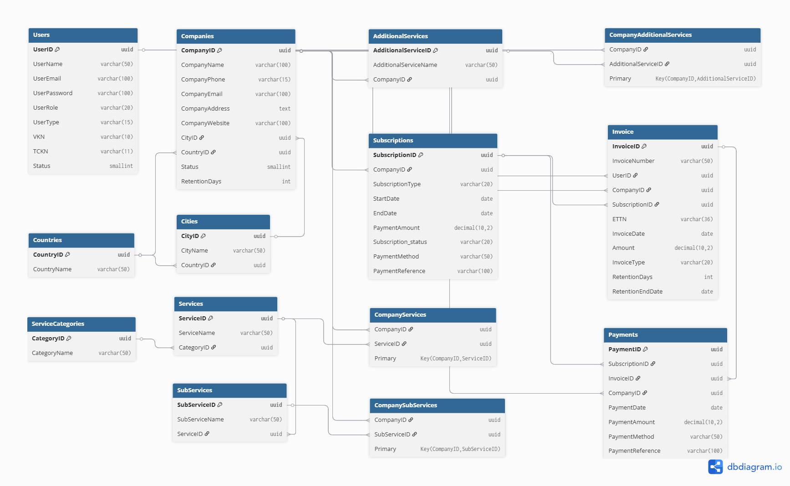

# Fixeria B2B Logistics Platform — PostgreSQL Database

## Overview

**Fixeria** is a sample B2B logistics and transportation platform designed as a portfolio project for learning **intermediate-level SQL and database design**.

**Main idea:**  
Producers, logistics companies, or individuals can sign up on the website and submit transportation/storage service requests through a simple form.  
Registered logistics companies can receive these requests and reach out to the requester with offers.  
The platform generates revenue through monthly subscription plans for companies to list their services and get more leads.

---

## Project Scope

This PostgreSQL database structure includes:
- **Company management:** Producers, logistics companies, individual firms.
- **User management:** Individual, corporate, and system users.
- **Services & sub-services:** Defines transportation and storage service categories.
- **Subscriptions & payments:** Companies pay monthly fees to appear on the platform.
- **Invoices:** Retention days, automatic calculations, and audit logs.
- **Triggers & functions:**
  - Auto-assign user roles based on type
  - Dynamic subscription status updates
  - Audit log tables for inserts, updates, deletes
- **Views:** Quickly list active services for active companies.

---

## File Structure

| File | Description |
| --- | --- |
| `fixeria_schema.sql` | Tables & ENUM definitions |
| `functions_triggers_views.sql` | Functions, triggers, views |
| `queries.sql` | Example test queries |
| `Fixeria_ERD.png` | ER Diagram |

---

## How to Use

1. Make sure PostgreSQL is installed with the `uuid-ossp` extension enabled.
2. Run `fixeria_schema.sql` to create all tables and types.
3. Run `functions_triggers_views.sql` to add business logic and views.
4. Test using `queries.sql`.
5. Use `Fixeria_ERD.png` to visualize the entity relationships.

---

## ER Diagram

---

## Technologies

- PostgreSQL (recommended v13+)
- pgAdmin4 (optional)
- `uuid-ossp` extension

---

## License

This project is for educational and portfolio demonstration purposes only.  
Commercial use is not permitted.

---

## Author

Prepared by **Pelin Ermisket**  
